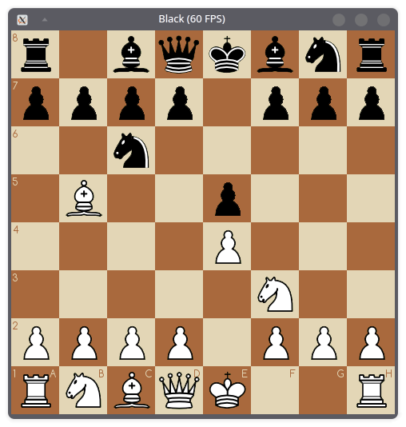
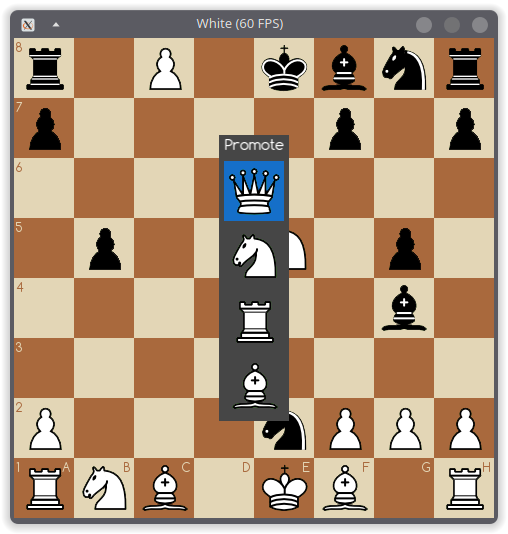

# Chess

Build Requirements:
- C++17 or greater
- SFML
- fmt

Font is [Comfortaa](https://www.fontspace.com/comfortaa-font-f8306).
Pieces are from [Wikimedia](https://commons.wikimedia.org/wiki/Category:PNG_chess_pieces/Standard_transparent).